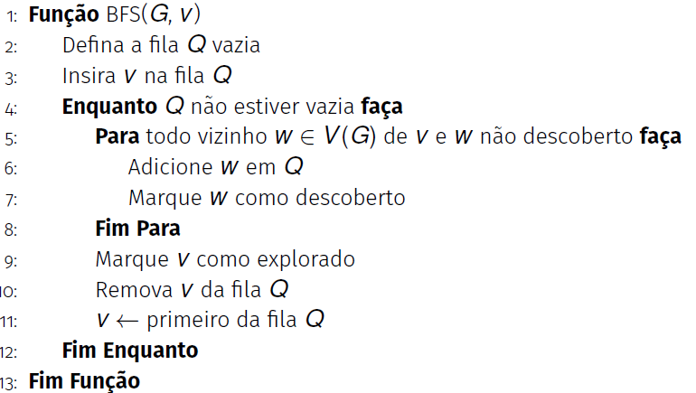

# Introdução à Implementação da Busca em Largura em C++

- A busca em largura (Breadth-First Search, BFS) é um algoritmo fundamental para percorrer ou buscar elementos em grafos.
- Explora os vértices de forma sistemática, visitando primeiro os vizinhos mais próximos do vértice inicial.
- Utiliza uma fila (`queue`) para controlar a ordem de visitação dos vértices.
- Um vetor de visitados é usado para evitar ciclos e repetições.
- Aplicações comuns incluem:
    - Verificação de conectividade em grafos
    - Cálculo de distâncias mínimas
    - Resolução de problemas em redes


## Relembrano do algoritmo



## Implementação do algoritmo BFS em C++

A seguir está uma implementação básica da busca em largura para um grafo representado por matriz de adjacência:

```cpp
#include <queue> // Necessário para usar fila

// Função de busca em largura (BFS)
void buscaEmLargura(const Grafo &g, int inicio) {
    bool visitado[MAX_VERTICES] = {false}; // vetor de visitados
    queue<int> fila;

    visitado[inicio] = true;
    fila.push(inicio);

    cout << "Busca em Largura a partir do vértice " << inicio << ": ";

    while (!fila.empty()) {
        int atual = fila.front();
        fila.pop();
        cout << atual << " ";

        for (int i = 0; i < g.num_vertices; i++) {
            if (g.matriz[atual][i] != 0 && !visitado[i]) {
                visitado[i] = true;
                fila.push(i);
            }
        }
    }

    cout << "\n";
}
```

### Explicação da implementação

- **Vetor de Visitados:** O vetor `visitado` garante que cada vértice seja visitado apenas uma vez, evitando ciclos.
- **Fila:** A fila (`queue`) armazena os vértices a serem visitados, garantindo a ordem correta da BFS.
- **Processo:** 
    1. O vértice inicial é marcado como visitado e inserido na fila.
    2. Enquanto a fila não estiver vazia, remove-se o vértice da frente, imprime-o e insere todos os seus vizinhos não visitados na fila.

Essa implementação pode ser adaptada para diferentes representações de grafos, como listas de adjacência.


## Como usar no main:
Adicione no final do `main()` a chamada:

```C++
buscaEmLargura(g, 0);
```