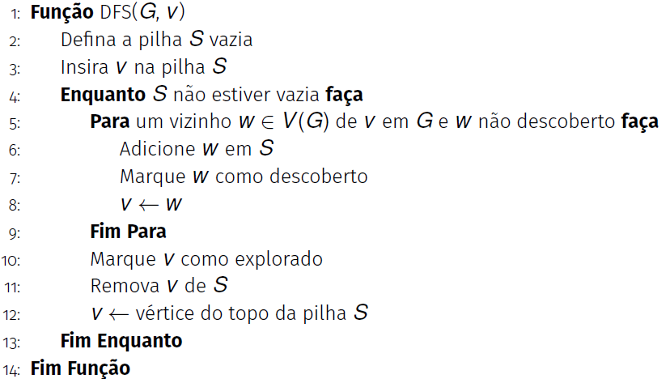

# Introdução à Implementação da Busca em Profundidade em C++

- A busca em profundidade (DFS - *Depth-First Search*) é um algoritmo essencial para explorar grafos.
- Permite visitar todos os vértices e arestas de um grafo de maneira sistemática.
- É utilizada em aplicações como:
    - Detecção de ciclos
    - Identificação de componentes conexas
    - Ordenação topológica
- A travessia pode ser feita com funções recursivas ou com a estrutura de dados pilha.


## Relembrando o algoritmo




## Implementação do DFS iterativo em C++

A seguir está uma implementação do algoritmo de busca em profundidade (DFS) utilizando uma pilha explícita em C++:

```cpp
#include <stack>

void buscaEmProfundidade(const Grafo &g, int inicio) {
    bool visitado[MAX_VERTICES] = {false};
    stack<int> pilha;

    pilha.push(inicio);

    cout << "Busca em profundidade a partir do vertice " << inicio << ": ";

    while (!pilha.empty()) {
        int v = pilha.top();
        pilha.pop();

        if (!visitado[v]) {
            visitado[v] = true;
            cout << v << " ";

            for (int i = g.num_vertices - 1; i >= 0; i--) {
                if (g.matriz[v][i] != 0 && !visitado[i]) {
                    pilha.push(i);
                }
            }
        }
    }

    cout << "\n";
}
```

### Explicação do código

- **Vetor de visitados:** Garante que cada vértice seja visitado apenas uma vez.
- **Uso da pilha:** A pilha armazena os vértices a serem explorados, simulando a recursão.
- **Processo de visita:** Ao remover um vértice da pilha, ele é marcado como visitado e seus vizinhos não visitados são empilhados.
- **Ordem de inserção:** Os vizinhos são inseridos do maior para o menor índice para manter a ordem de visita semelhante à recursiva.

Essa abordagem evita o uso de recursão, sendo útil para grafos grandes ou ambientes com limitação de pilha.
