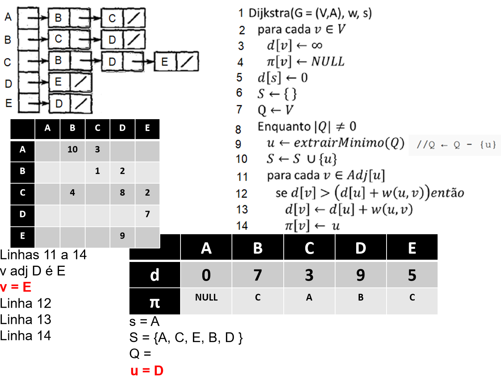

# Caminho Mais Curto a partir de uma Origem

## Motivação
- Um motorista deseja encontrar a rota mais curta possível do Rio de Janeiro a São Paulo.
- Como determinar essa rota em um mapa rodoviário, onde as distâncias entre interseções estão marcadas?

## Abordagem Ingênua
- Enumerar todas as rotas possíveis entre Rio de Janeiro e São Paulo.
- Somar as distâncias de cada rota e escolher a menor.
- **Problema:** Mesmo ignorando rotas com ciclos, o número de possibilidades é enorme e a maioria não faz sentido considerar.

## Exemplo de Rota Ineficiente
- Uma rota passando por Brasília entre Rio de Janeiro e São Paulo é claramente ruim, pois Brasília está muito fora do caminho.

## Modelagem com Grafos
- O mapa rodoviário pode ser modelado como um grafo:
    - **Vértices:** Interseções.
    - **Arestas:** Segmentos de estrada entre interseções.
    - **Pesos das arestas:** Distâncias rodoviárias.

## Algoritmos para Caminhos Mais Curtos
- **Dijkstra:** Supõe que todos os pesos das arestas são não negativos (caso típico de mapas rodoviários).
- **Bellman-Ford:** Permite arestas com pesos negativos e encontra o caminho mais curto, desde que não haja ciclos negativos acessíveis a partir da origem.
    - Se existir um ciclo de peso negativo acessível, o algoritmo pode detectar e relatar sua existência.

## Sobre o Algoritmo de Dijkstra

- O algoritmo de Dijkstra foi concebido pelo cientista da computação holandês Edsger Dijkstra em 1956 e publicado em 1959.
- Ele resolve o problema do caminho mais curto em um grafo dirigido ou não dirigido com arestas de peso não negativo.
- É o algoritmo mais famoso para o cálculo de caminhos de custo mínimo entre vértices de um grafo e, na prática, o mais utilizado.

## Funcionamento do Algoritmo de Dijkstra

- Escolha um vértice como raiz da busca.
- O algoritmo calcula o custo mínimo desse vértice para todos os outros vértices do grafo.
- Pode ser aplicado em grafos orientados (dígrafos) ou não orientados.
- Exige que todas as arestas tenham pesos não negativos (zero é permitido).
- Essa restrição faz sentido em redes de transporte, onde arestas representam distâncias ou tempos.
- O algoritmo começa com uma estimativa inicial dos custos mínimos e ajusta essas estimativas sucessivamente.

## Relacionamentos de Peso

Relacionamentos entre objetos nem sempre são idênticos (mesma intensidade). Exemplos:

- **Amizade:** mais ou menos amigo no Facebook
- **Distância física:** perto ou longe
- **Tempo de translado:** mais ou menos tempo

## Grafos com Pesos

- Em muitos problemas, é útil anotar as arestas do grafo com a “intensidade” do relacionamento, chamada de **peso** da aresta (*weight*).
- O peso pode representar distância, custo, tempo, capacidade, etc.
- Formalmente, define-se uma função de peso `w(u, v)` que retorna o peso da aresta entre os vértices `u` e `v`.
- Em grafos ponderados, os algoritmos de caminhos mais curtos levam esses pesos em consideração para determinar a melhor rota.

## Relaxamento de Arestas

- Inicialmente, faz-se uma estimativa pessimista para o caminho mínimo até cada vértice: `d(v) = ∞` para todo vértice `v`, exceto a origem, que recebe `d(origem) = 0`.
- O processo de **relaxar uma aresta** consiste em verificar se é possível melhorar a estimativa do caminho mínimo até um vértice `v` passando por um vértice `u`.
- Para cada aresta `(u, v)`, se `d(v) > d(u) + w(u, v)`, então atualiza-se `d(v)` para `d(u) + w(u, v)`.
- O relaxamento é a base dos algoritmos de caminhos mínimos, como Dijkstra e Bellman-Ford, permitindo que as estimativas sejam progressivamente melhoradas até encontrar o valor ótimo.
- O processo é repetido até que nenhuma estimativa possa ser melhorada.

## Algoritmo de Dijkstra

- Inicialize a distância de todos os vértices como infinito, exceto a origem, que recebe distância zero.
- Marque todos os vértices como não visitados.
- Crie um conjunto de vértices não processados (fila de prioridade).
- Enquanto houver vértices não processados:
    - Selecione o vértice não visitado com a menor distância estimada.
    - Marque esse vértice como visitado.
    - Para cada vizinho desse vértice:
        - Calcule a distância total do início até o vizinho passando pelo vértice atual.
        - Se essa distância for menor que a estimativa anterior, atualize a distância do vizinho.
- O algoritmo termina quando todos os vértices foram visitados ou quando não há mais vértices acessíveis.
- Ao final, as menores distâncias da origem para cada vértice estarão determinadas.

## Estruturas necessárias

### Estruturas de Dados Utilizadas

Para implementar o algoritmo de Dijkstra, são necessárias as seguintes estruturas:

- **Vetor de distâncias (`d[u]`)**: Armazena a menor distância conhecida da origem até cada vértice.
- **Vetor de predecessores (`π[u]`)**: Guarda o vértice anterior no caminho mais curto para cada vértice, permitindo reconstruir o caminho ao final.
- **Conjunto de vértices visitados (`S`)**: Indica quais vértices já tiveram sua menor distância determinada.
- **Fila de prioridade (`Q`)**: Permite selecionar o vértice não visitado com a menor distância estimada.

## Vamos demonstrar passo a passo o algoritmo

Vamos fazer com o seguinte grafo:

### Passo a passo

### Passo 1

### Passo 2

### Passo 3

### Passo 4

### Passo 5

### Passo 6

### Passo 7

### Passo 8

### Passo 9

### Passo 10

### Passo 11

### Passo 12

### Passo 13

### Passo 14

### Passo 15

## Exercício
