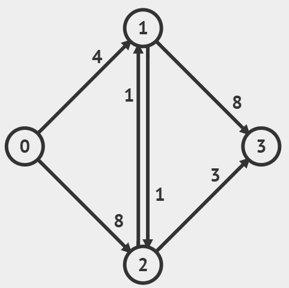
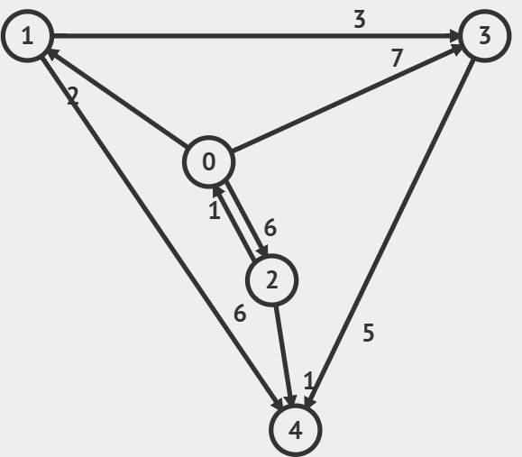
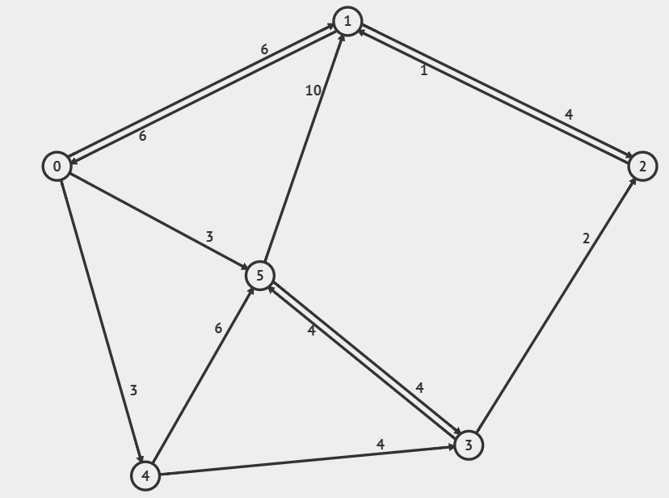
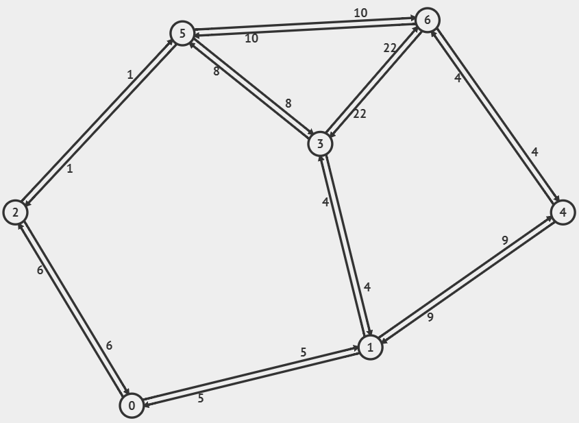

# Lista de Exercícios – Algoritmo de Dijkstra

1 - Dado grafo 1 abaixo, elabore o passo a passo do algoritmo Dijkstra.

A) Faça com a origem sendo o vértice 0.

B) Faça com a origem sendo o vértice 2.

2 - Dado grafo 2 abaixo, elabore o passo a passo do algoritmo Dijkstra.

A) Faça com a origem sendo o vértice 0.

B) Faça com a origem sendo o vértice 2.

3 - Dado grafo 3 abaixo, elabore o passo a passo do algoritmo Dijkstra.

A) Faça com a origem sendo o vértice 0.

B) Faça com a origem sendo o vértice 5.

4 - Dado grafo 4 abaixo, elabore o passo a passo do algoritmo Dijkstra.

A) Faça com a origem sendo o vértice 6.

B) Faça com a origem sendo o vértice 3.

# Respostas finais

1 - A)
|   | 0 | 1 | 2 | 3 |
|---|---|---|---|---|
| d | 0 | 4 | 5 | 8 |
| π | - | 0 | 1 | 2 |

1 - B)
|   | 0 | 1 | 2 | 3 |
|---|---|---|---|---|
| d | ∞ | 1 | 0 | 3 |
| π | - | 2 | - | 2 |

2 - A)
|   | 0 | 1 | 2 | 3 | 4 |
|---|---|---|---|---|---|
| d | 0 | 2 | 6 | 5 | 7 |
| π | - | 0 | 0 | 1 | 2 |

2 - B)
|   | 0 | 1 | 2 | 3 | 4 |
|---|---|---|---|---|---|
| d | 1 | 3 | 0 | 6 | 1 |
| π | 2 | 0 | - | 1 | 2 |

3 - A)
|   | 0 | 1 | 2 | 3 | 4 | 5 |
|---|--:|--:|--:|--:|--:|--:|
| d | 0 | 6 | 9 | 7 | 3 | 3 |
| π | - | 0 | 3 | 4 | 0 | 0 |

3 - B)
|   | 0  | 1 | 2 | 3 | 4  | 5 |
|---|--: |--:|--:|--:|--: |--:|
| d | 13 | 7 | 6 | 4 | 16 | 0 |
| π | 1  | 2 | 3 | 5 | 0  | - |

4 - A)
|   | 0  | 1  | 2  | 3  | 4 | 5  | 6 |
|---|--: |--: |--: |--: |--:|--: |--:|
| d | 17 | 13 | 11 | 17 | 4 | 10 | 0 |
| π | 2  | 4  | 5  | 1  | 6 | 6  | - |

4 - B)
|   | 0 | 1 | 2 | 3 | 4  | 5 | 6  |
|---|--:|--:|--:|--:|--: |--:|--: |
| d | 9 | 4 | 9 | 0 | 13 | 8 | 17 |
| π | 1 | 3 | 5 | - | 1  | 3 | 4  |

